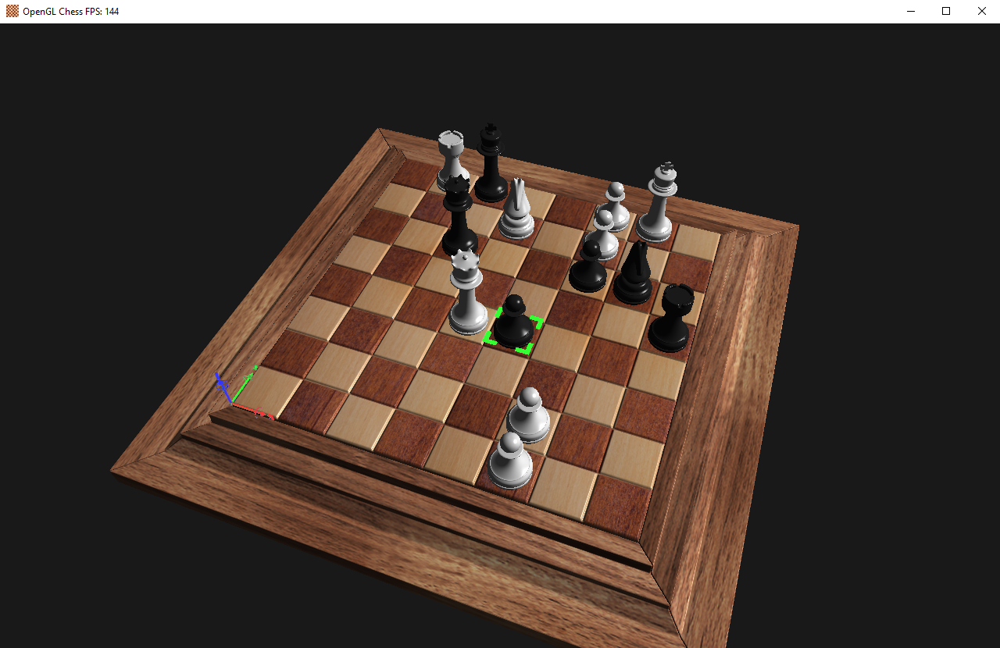

# OpenGL chess demo

 

| Key        | Action     |
|------------------------|-----------|
| WASD | Move |
| Space | Up |
| Shift | Down |
| LMB | Select chess piece |
| Escape | Exit |
| Z | Wireframe |
| Q | Perspective white |
| E | Perspective black |
| R, NUM_0 | Perspective default |
| NUM1, NUM3, NUM7 | Perspective Front, left, top |
| F | Print camera position |

 

 

* Chess pieces models from Rehten@https://blendswap.com/blend/24490
